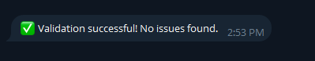
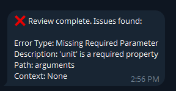

# Telegram-json-schema-validator-bot

The purpose of this bot is to receive JSON schema of AI conversations with function calls and validate the function call with the schema,

## 🤖 Bot Commands
This Telegram bot allows you to validate JSON data against schemas and review AI tool call conversations. Below are the available commands:

| Command      | Description                                                                 |
|-------------|-----------------------------------------------------------------------------|
| `/start`     | Starts the bot and shows a welcome message.                                  |
| `/validate`  | Starts the JSON validation process. The bot will ask for:                  |
|             | 1. A JSON schema.                                                           |
|             | 2. JSON data to validate against the schema.                                |
|             | The bot will then return a success message or detailed validation errors.   |
| `/review`    | Review a complete AI tool call conversation. You must send a JSON payload containing both `schema` and `data`. |
|             | The bot checks the payload and returns any issues found.                     |
| `/cancel`    | Cancels the current validation or review operation at any time.             |

---

## 📤 Examples

Here are example JSON payloads you can send to the bot for each command.

---

### 1️⃣ `/validate` Command

**Step 1: Send the JSON Schema**

```json
{
  "type": "object",
  "properties": {
    "tool_name": {"type": "string"},
    "parameters": {
      "type": "object",
      "properties": {
        "city": {"type": "string"},
        "units": {"type": "string", "enum": ["metric", "imperial"]}
      },
      "required": ["city", "units"]
    }
  },
  "required": ["tool_name", "parameters"]
}
```
**Step 2: Send the JSON Data to Validate**

```json
{
  "tool_name": "weather_tool",
  "parameters": {
    "city": "Boston",
    "units": "metric"
  }
}
```
**Result ✅**



### 2️⃣ `/review` Command
**Send the Json payload containind both Schema and data together.**
```json
{
  "schema": {
    "type": "object",
    "properties": {
      "name": {"type": "string"},
      "arguments": {
        "type": "object",
        "properties": {
          "location": {"type": "string"},
          "unit": {"type": "string"}
        },
        "required": ["location", "unit"]
      }
    },
    "required": ["name", "arguments"]
  },
  "data": {
    "name": "get_current_weather",
    "arguments": {
      "location": "Boston, MA"
    }
  }
}
```
**Result ❌**
